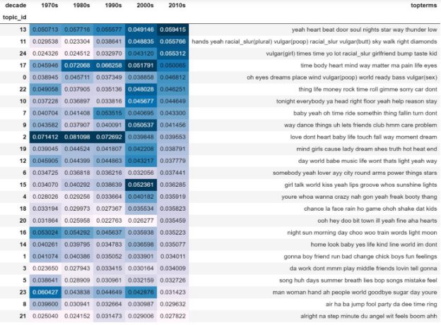
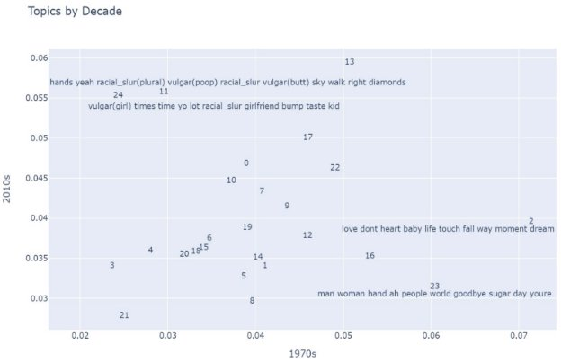
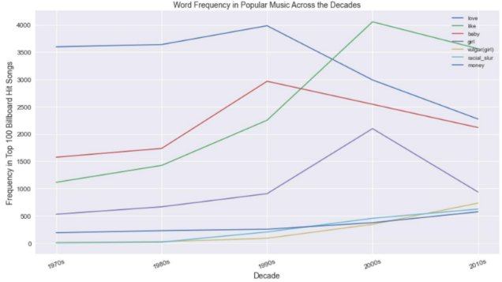
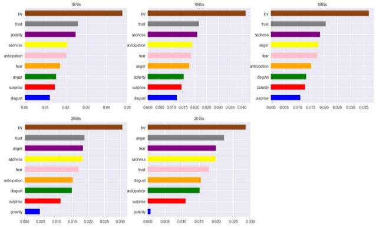
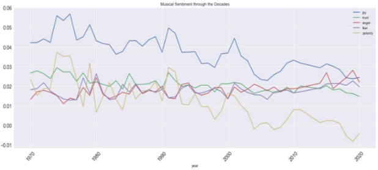
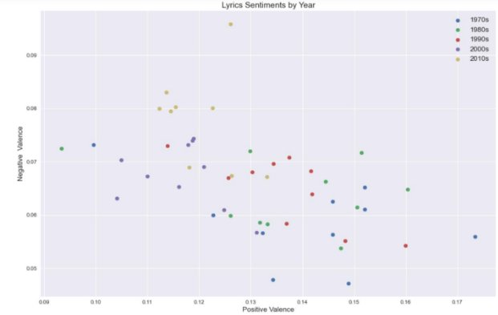
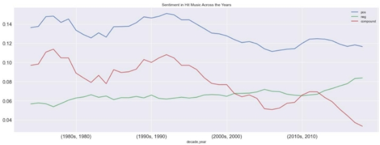
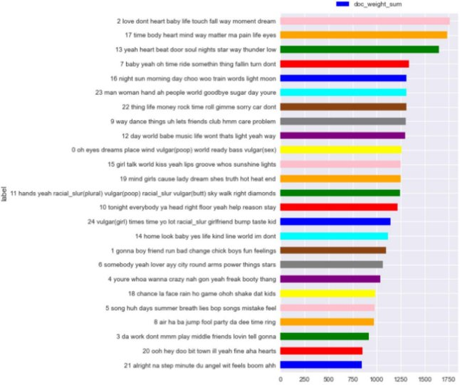
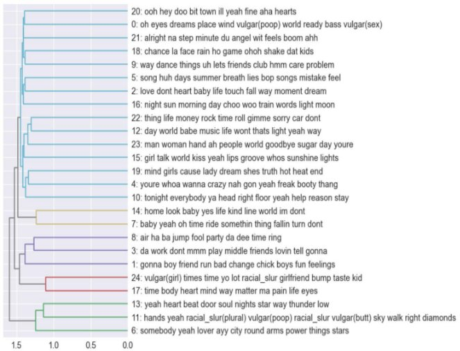
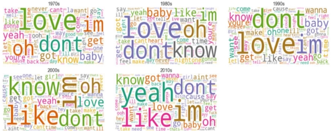

# Billboard Hot 100 Lyrics Through the Decades

**Intro:** 

Culturomics is loosely defined as making inferences about cultural trends through the quantitative analysis of digitized texts. Although there are hundreds, if not thousands, of different forms of texts, I believe different ones better capture the cultural attitude and viewpoints of a society at certain time periods. By this, I mean that there are prevailing forms of media given a society’s location and point in history which best express the views of the overall public. For example, one could argue that currently social media giants (Facebook, Instagram, Twitter, etc.) are this outlet, as it gives any individual with internet access the ability to share their views at any point in time. Before this, one could argue the prior hundred years had been completely dominated by newspapers, and before that novels. However, I believe one of the most telling and lasting forms of a society’s views and trends is its choice in music. Wing-Wah Law and Wai-Chung Ho, professors at the University of Hong Kong, concluded in their 2011 study (first published in February 2015), that a society’s popular music reflects the ideals that are prevalent at the time it is performed or published. Following this theory, I decided it would be interesting to see the evolution of American ideals/views over the past 50 years by analyzing the annual *Billboard* Hot 100 charts of this time period. These year-end charts are calculated using the cumulative total of yearlong record sales, streaming and airplay (radio) points. By analyzing the lyrics contained in the most listened to songs each year in the United States, via Topic Modeling and Sentiment Analysis, I hoped to glean a bit of insight into the prevailing viewpoints of the American public at these points in time, and see possible shifts in these sentiments throughout the past five decades. 

**Data Collection:** 

Since there was no readily available text or spreadsheet data on all these songs’ lyrics, I had to utilize a combination of various packages to get the data necessary to conduct this analysis. The BeautifulSoup web-scraping package was utilized to scrap each year-end charts’ info, specifically the song title and respective artist. From there, this data was feed into a package called LyricsGenius, designed by John Miller to specifically pull song and artist information from the website *Genius*, which claims to have the most extensive collection of song lyrics online (they are my personal go-to when I am trying to see what a song’s lyrics are). LyricsGenius is a fantastic package, with a variety of functions that were especially useful in gathering metadata to assist further with my analysis, however, it is not one hundred percent perfect, so a little more manual cleaning of my source file was required after the web-scraping function finished running. After adding an additional data point to identify which decade each song charted, I converted my data to the required F2 table formats and was ready to begin my analysis. 

**Topic Modeling:** 

I began my analysis by utilizing LDA to create topic models across my corpus & see which topics were most associated with each decade. The below results represent a model generated using 5,000 terms (classified as nouns by NLTK) in the count vectorization and 25 topics in the LDA algorithm, sorted by topics most associated with the past decade (2010’s). 

As can be seen in the above, the topic most associated with the past decade is topic #13, which also happens to have a fairly high association with the all the other decades of music. Given the top terms in this topic, I would wager to say this topic is indicative of the rhythm and blues genre of music. Words such as “heart”, “beat” and “soul” have always been strongly identified with R&B music, but the base genre of blues, which R&B is derived from, strongly incorporates other musical forms, such as chants (“yeah”) and spirituals, which invoked the poignant lyrics of sentimental ballads to express one’s desperate emotional state (“low”). Consequently, the genres of music considered most popular throughout the decades in the analysis are all derivatives of R&B. Rock and roll, and its subsequent forms (such as metal, punk and alternative), is widely considered the most popular musical genre throughout the 1970’s up until the mid-nineties. At this point, rap, hip-hop and contemporary R&B started seeing a rise in popularity with the American public; a trend which continues to this day. 

Most telling from this analysis is when we look at the second and third topics most associated with the past decade. They greatly differ in terms of association with the pre-2000 decades, specifically the seventies and eighties. I decided to take a closer look at the evolution of popular topics by plotting those of the seventies against those of the past decade. 

The most evident difference when looking at the above scatterplot is the increase in explicit lyrical content over the past fifty years. Music in the seventies appeared to be more emotionally loving, as evident by many of the tender terms in topics 2 (“love”, “heart”, “baby”) and 23 (“sugar”), whereas the 2010’s is associated with swear words (“a\*\*” and “sh!t”). The seventies also utilized, what many would consider, appropriate nouns for referencing others (“man”, “woman”, “people”), whereas the past decade utilizes slang, sometimes considered crass or inappropriate, language for addressing other people (“b!tch”, “kid”, n-word). Finally, it appears lyrics in the seventies were more introspective (“dream”, “life”, “moment”), but the 2010’s are more materialistic, as evident by topic 11 terms such as “diamonds” and “money” (which is the 15th top term in the topic). The below chart further illustrates the transition from loving, tender terms, to more explicit ones, as the terms “love” and “baby” have significantly decreased in lyrical usage over the past two decades, while the word “b!tch” (which is used almost as frequently as “girl” now) and the n-word have seen a steady increase over the same time period. 

**Sentiment Analysis:** 

Delving further into the lyrics, I performed sentiment analysis to see what the most listened to songs could reveal about the mood of the American population over the course of the past fifty years, and how this mood may have shifted across the decades. 

The above charts show that while joy has been the predominant emotion expressed in popular music over the past 50 years, it has seen an overall decline in each decade since the 1970’s. Meanwhile, more negative emotional terms, specifically those of anger and fear, have seen steady increases in popular music, so much so that anger and fear were the second and third most dominant emotions in music of the past decade, respectively. Negative terms were so dominant in music over the past several years, that the overall polarity of the most popular music indicates a general negative emotional mood in the American population. This conclusion is further illustrated in the below scatterplot. 

As can be seen in the above chart, the top six most negative “emotional years” in popular music have all been from the past decade, while the seven through nine spots are occupied by years from the decade before that. These same data points are all also on the lower half of the positive sentiment axis, contributing to the decrease in the overall polarity of popular music since the turn of the millennium. The below graph further illustrates that since the mid to late- nineties (when the rise in gangsta rap, grunge and alternative rock began), there has been a steady decrease in positive sentiment in popular music, met with a corresponding steady increase in negative sentiment. 

**Conclusion:** 

If Law and Ho’s theory that a society’s popular music reflects the ideals that are prevalent at the time is to be believed, then, given the results of this analysis, it’s fair to say that American society has seen a gradual decline in positivity over the past fifty years, while negative sentiments, specifically those of anger and fear, have seen gradual increases, especially in the past decade. While I cannot confirm that these results one hundred percent accurately reflect the overall mood in America during the studied period, as music and its lyrics are not the only indicators of cultural trends, I do believe they provide some insight into the overall cultural attitude. Specifically, events of the past several years (and especially the one in DC at the start of this year), indicate a growing fear and anger in America, a trend accurately captured by these results. I only hope that we can see the compound valence/sentiment of the red line in the above graph start increasing again. 

**Appendix of Additional Visuals:** 

Overall Topics in the Data 

Clustering of the Topics 

Word Clouds by Decade 

(Notice Decrease in tender terms such as “love” and “baby”) 

